# KIVON - Modelagem do Banco V1

## Objetivo

Esta modelagem define a fundacao de dados do ERP KIVON. A V1 cobre usuarios, perfis, obras, funcionarios, cargos, presenca, fotos de presenca e auditoria. Regras criticas devem continuar no PostgreSQL/Supabase por meio de constraints, views, functions, triggers e RLS.

## DER

```mermaid
erDiagram
  AUTH_USERS ||--|| USERS : autentica
  PROFILES ||--o{ USERS : autoriza
  JOB_ROLES ||--o{ EMPLOYEES : classifica
  PROJECTS ||--o{ PROJECT_EMPLOYEES : possui
  EMPLOYEES ||--o{ PROJECT_EMPLOYEES : alocado
  PROJECTS ||--o{ PRESENCE : recebe
  EMPLOYEES ||--o{ PRESENCE : registra
  USERS ||--o{ PRESENCE : lancou
  PROJECTS ||--o{ PRESENCE_PHOTOS : contem
  EMPLOYEES ||--o{ PRESENCE_PHOTOS : fotografado
  USERS ||--o{ PRESENCE_PHOTOS : capturou
  PRESENCE_PHOTOS ||--o{ PRESENCE : comprova
  USERS ||--o{ AUDIT_LOGS : alterou

  AUTH_USERS {
    uuid id PK
  }

  PROFILES {
    uuid id PK
    app_role code UK
    text name UK
    boolean active
    timestamptz created_at
    timestamptz updated_at
  }

  USERS {
    uuid id PK,FK
    uuid profile_id FK
    text full_name
    boolean active
    timestamptz created_at
    timestamptz updated_at
  }

  JOB_ROLES {
    uuid id PK
    text name UK
    numeric daily_rate
    boolean active
    timestamptz created_at
    timestamptz updated_at
  }

  PROJECTS {
    uuid id PK
    text name
    text code UK
    text address
    date started_at
    date finished_at
    boolean active
    timestamptz created_at
    timestamptz updated_at
  }

  EMPLOYEES {
    uuid id PK
    uuid job_role_id FK
    text full_name
    text document_number UK
    boolean active
    timestamptz created_at
    timestamptz updated_at
  }

  PROJECT_EMPLOYEES {
    uuid id PK
    uuid project_id FK
    uuid employee_id FK
    date assigned_at
    date unassigned_at
    boolean active
    timestamptz created_at
    timestamptz updated_at
  }

  PRESENCE_PHOTOS {
    uuid id PK
    uuid project_id FK
    uuid employee_id FK
    date presence_date
    uuid captured_by FK
    timestamptz captured_at
    text storage_bucket
    text storage_path UK
    boolean active
    timestamptz created_at
    timestamptz updated_at
  }

  PRESENCE {
    uuid id PK
    uuid project_id FK
    uuid employee_id FK
    shift_type shift
    date presence_date
    uuid photo_id FK
    uuid registered_by FK
    timestamptz registered_at
    boolean active
    timestamptz created_at
    timestamptz updated_at
  }

  AUDIT_LOGS {
    uuid id PK
    text table_name
    uuid record_id
    audit_operation operation
    uuid changed_by FK
    jsonb old_data
    jsonb new_data
    timestamptz changed_at
    timestamptz created_at
    timestamptz updated_at
  }
```



## Dicionario de Dados

### `profiles`

Perfis de acesso do sistema. A V1 permite apenas `admin` e `operador`.

- `id`: identificador interno.
- `code`: enum `app_role`, unico.
- `name`: nome exibivel do perfil.
- `description`: descricao administrativa.
- `active`: permite inativar um perfil sem exclusao fisica.

### `users`

Perfil publico e operacional do usuario autenticado no Supabase Auth.

- `id`: mesmo UUID de `auth.users.id`.
- `profile_id`: perfil de acesso.
- `full_name`: nome exibivel.
- `active`: bloqueia acesso sem apagar o usuario autenticado.

### `job_roles`

Cargos exercidos pelos funcionarios.

- `name`: nome unico do cargo.
- `daily_rate`: valor da diaria usado futuramente por functions de calculo.
- `active`: cargos sao inativados, nao excluidos.

### `projects`

Obras gerenciadas no ERP.

- `name`: nome da obra.
- `code`: codigo opcional unico.
- `address`: endereco.
- `started_at` e `finished_at`: ciclo da obra.
- `active`: obras sao inativadas, nao excluidas.

### `employees`

Funcionarios da construcao.

- `job_role_id`: cargo atual.
- `full_name`: nome usado em listagens alfabeticas.
- `document_number`: documento unico opcional.
- `admission_date` e `termination_date`: datas de vinculo.
- `active`: funcionarios sao inativados, nao excluidos.

### `project_employees`

Relacionamento entre obras e funcionarios.

- `project_id`: obra.
- `employee_id`: funcionario.
- `assigned_at`: inicio da alocacao.
- `unassigned_at`: fim da alocacao.
- `active`: indica alocacao vigente.

### `presence_photos`

Metadados das fotos salvas no Supabase Storage privado.

- `project_id`: obra vinculada.
- `employee_id`: funcionario fotografado.
- `presence_date`: data da presenca.
- `captured_by`: usuario que capturou.
- `captured_at`: horario da captura.
- `storage_bucket`: sempre `presence-photos`.
- `storage_path`: caminho privado do objeto no bucket.
- `mime_type` e `file_size_bytes`: metadados tecnicos.

### `presence`

Registros de presenca por obra, funcionario, data e turno.

- `shift`: enum `manha` ou `tarde`.
- `photo_id`: foto vinculada quando exigida.
- `registered_by`: usuario operador/admin que registrou.
- `registered_at`: horario do registro.

### `audit_logs`

Trilha de auditoria para mudancas futuras.

- `table_name`: tabela afetada.
- `record_id`: registro afetado.
- `operation`: `insert`, `update` ou `delete`.
- `changed_by`: usuario autenticado.
- `old_data` e `new_data`: snapshots JSONB.
- `changed_at`: horario da alteracao.

## Relacionamentos

- `auth.users` 1:1 `users`
- `profiles` 1:N `users`
- `job_roles` 1:N `employees`
- `projects` N:N `employees` via `project_employees`
- `projects` 1:N `presence`
- `employees` 1:N `presence`
- `users` 1:N `presence`
- `projects` 1:N `presence_photos`
- `employees` 1:N `presence_photos`
- `users` 1:N `presence_photos`
- `presence_photos` 1:N `presence`
- `users` 1:N `audit_logs`

## Constraints Principais

- UUID como chave primaria em todas as tabelas.
- `profiles.code` unico e limitado ao enum `admin`/`operador`.
- `presence.shift` limitado ao enum `manha`/`tarde`.
- `presence` nao permite duplicidade por `employee_id`, `project_id`, `presence_date` e `shift`.
- `presence_photos` nao permite mais de uma foto por funcionario, obra e data.
- `job_roles.daily_rate` deve ser maior ou igual a zero.
- Datas finais nao podem ser anteriores as datas iniciais.
- FKs usam `on delete restrict` para preservar integridade e auditoria.

## Indices

Os indices da V1 priorizam:

- busca por funcionarios ativos em ordem alfabetica;
- obras ativas por nome/codigo;
- presenca por obra, funcionario, data e turno;
- fotos por funcionario/obra/data;
- auditoria por tabela, registro, usuario e data.

## Views

- `vw_funcionarios_ativos`: funcionarios ativos com cargo e valor da diaria.
- `vw_obras_ativas`: obras ativas.
- `vw_presenca_hoje`: registros ativos do dia corrente.
- `vw_total_diarias`: totais por funcionario, obra e data.
- `vw_fotos_presenca`: metadados de fotos sem URL publica.

## Functions Planejadas

- `registrar_presenca(project_id, employee_id, presence_date, shift, photo_id)`: contrato principal para inserir presenca.
- `calcular_diaria(employee_id, presence_date)`: calcula total de diaria do funcionario na data.
- `obter_funcionarios_da_obra(project_id)`: lista funcionarios ativos da obra em ordem alfabetica.
- `registrar_auditoria()`: trigger function futura para preencher `audit_logs`.
- `current_user_profile()`, `is_admin()`, `is_operator()`: helpers de RLS.
- `set_updated_at()`: trigger function ja definida para `updated_at`.

## Triggers Planejados

Implementado agora:

- `updated_at` automatico em todas as tabelas publicas da V1.

Planejado para migracoes futuras:

- auditoria automatica em tabelas de negocio;
- bloqueio de exclusao fisica de obras e funcionarios;
- validacao de foto obrigatoria no primeiro registro da manha;
- validacao de alocacao ativa entre funcionario e obra antes da presenca.

## RLS

ADMIN:

- acesso total as tabelas operacionais;
- leitura da auditoria;
- acesso total aos objetos do bucket privado `presence-photos`.

OPERADOR:

- leitura apenas de dados necessarios ao cadastro de presenca;
- insert em `presence`;
- insert em `presence_photos`;
- leitura dos proprios registros/fotos quando necessario;
- sem acesso a usuarios, cargos administrativos, auditoria ou manutencoes.

As policies do frontend sao apenas uma conveniencia de UX. A seguranca real e definida no banco.

## Storage

Bucket privado:

- `presence-photos`

Regras:

- `public = false`;
- sem URL publica;
- tipos permitidos: `image/jpeg`, `image/png`, `image/webp`;
- limite inicial: 10 MB;
- cada objeto deve possuir linha correspondente em `presence_photos`;
- acesso por signed URL temporaria somente em fluxo autorizado.

Sugestao de path:

```text
projects/{project_id}/employees/{employee_id}/{yyyy-mm-dd}/{photo_id}.jpg
```
